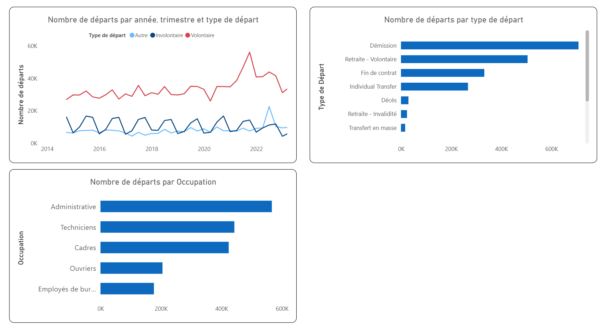
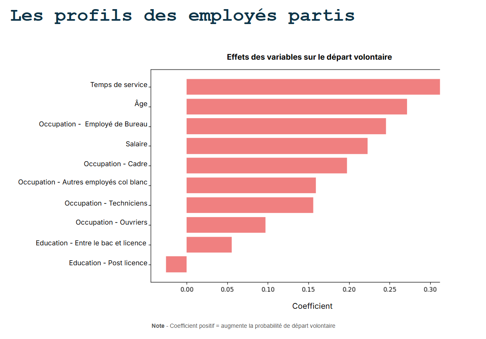

# people-analytics-attrition-demo
People Analytics : de la donnée brute aux recommandations RH grâce à la visualisation et au machine learning

# Analyse des départs d’employés – Projet démonstratif
People Analytics : de la donnée brute aux recommandations RH grâce à la visualisation et au machine learning

## Contexte
Projet réalisé dans le cadre d’une formation **Data Analyst Fullstack**.  
L’objectif est de mettre en pratique l’ensemble du cycle d’analyse de données, de la collecte à la restitution, sur un cas RH réel.  
Les données utilisées proviennent de l’**Office of Personnel Management (OPM)** aux États‑Unis. Elles sont **réelles mais entièrement anonymisées**, garantissant le respect de la confidentialité et de la protection des informations personnelles.

## Objectifs
- Suivre l’évolution des départs d’employés.
- Identifier les tendances et facteurs associés.
- Prédire les départs volontaires à l’aide de modèles de machine learning.

## Compétences mobilisées
- **Data cleaning** et préparation des données.
- **Visualisation** et storytelling des données.
- **Machine learning** supervisé.
- **Analyse exploratoire** et interprétation des résultats.

## Outils utilisés
- **Python** : pandas, scikit-learn
- **Power BI**
- **SQL**
- **Snowflake**

## Livrables
- Tableau de bord interactif (Power BI).
- Modèle prédictif d’attrition.
- Recommandations RH basées sur les résultats.

## 👀 Aperçu visuel
*(Captures d’écran du dashboard et des graphiques – données réelles anonymisées de l’OPM, USA)*  

 

## Structure du projet
- `data/` : données réelles anonymisées utilisées pour l’analyse (non diffusées intégralement dans ce dépôt).
- `notebooks/` : analyses exploratoires et modèles en Jupyter Notebook.
- `scripts/` : scripts Python réutilisables pour le traitement et la modélisation.
- `dashboard/` : fichiers Power BI (.pbix) ou exports liés au tableau de bord.
- `docs/` : documentation et visuels (captures d’écran, schémas).
