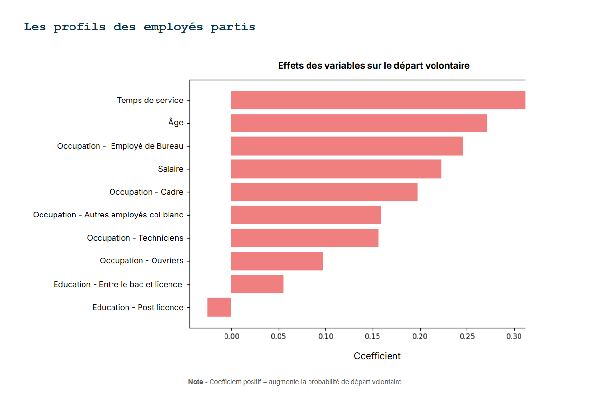

# People Analytics – Attrition des employés fédéraux
De la donnée brute aux recommandations RH grâce à la visualisation et au machine learning

## Contexte
Projet réalisé dans le cadre d’une formation **Data Analyst Fullstack**.
Objectif : mettre en pratique le cycle complet d’analyse de données RH.
- **Source des données** : Office of Personnel Management (OPM, USA).
- **Périodes couvertes** : 2015–2019 et 2020–2024.
- **Données réelles** mais entièrement anonymisées.

## Objectifs
- Suivre l’évolution des départs d’employés.
- Identifier les tendances et facteurs associés.
- Prédire les départs volontaires à l’aide de modèles de machine learning.

## Compétences mobilisées
- Nettoyage et préparation des données (Python, Pandas).
- Visualisation & storytelling (Power BI, Matplotlib).
- Machine learning supervisé (Scikit-learn).
- Analyse exploratoire et interprétation métier.

## Outils utilisés
- **Python** : pandas, scikit-learn
- **Power BI**
- **SQL**
- **Snowflake**

## Structure du projet
people-analytics-attrition-demo/

README.md             # Présentation générale (ce fichier)
data/                 # Données sources et échantillon public
notebooks/            # Notebooks Jupyter du pipeline
dashboard/            # Dashboard Power BI
docs/                 # Captures, schémas, documentation

## Résultats clés
- Nature des départs : principalement volontaires.
- Variables les plus influentes :
    - Ancienneté ≈ 12 ans
    - Âge ≈ 48 ans
- Performance du modèle de prédiction :
    - Accuracy = 0.80
    - F1-score = 0.73
    - AUC = 0.67

## Recommandations RH
- Améliorer les conditions de travail en général.
- Mener une analyse approfondie de la satisfaction au travail.
- Offrir davantage d’opportunités de développement de carrière.

## Aperçu visuel
*(Captures d’écran du dashboard et des graphiques – données réelles anonymisées de l’OPM, USA)*  

 

## Livrables
- Tableau de bord interactif (Power BI).
- Modèle prédictif d’attrition.
- Recommandations RH basées sur les résultats.