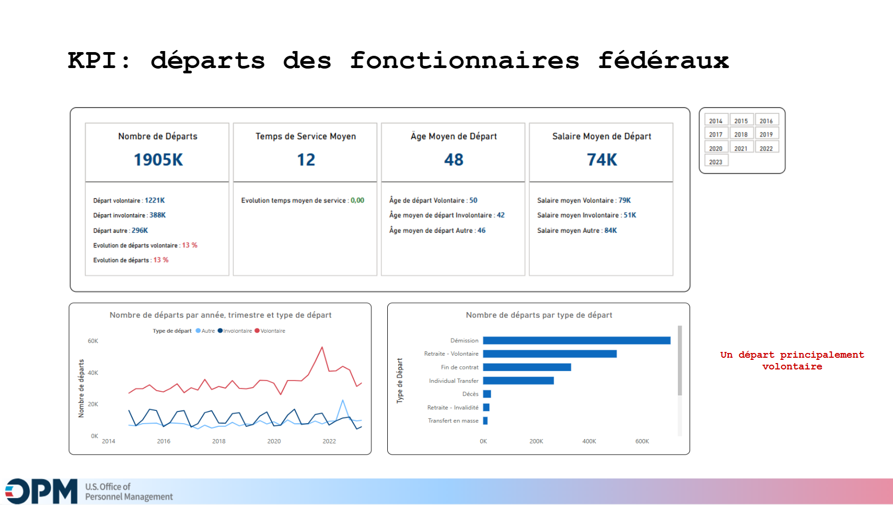

# Dashboard Power BI

Ce dossier contient le fichier Power BI utilisé pour l’analyse de l’attrition des employés fédéraux.

## Contenu
- `dashboard-demo.pbix` : fichier du tableau de bord interactif.

## Utilisation
1. 
2. L’ouvrir avec **Power BI Desktop** (version ≥ novembre 2022).
3. Explorer les pages du tableau de bord (vue globale, analyse par âge/ancienneté, prédictions ML).

## 👀 Aperçu
Voici un extrait visuel du tableau de bord :  

